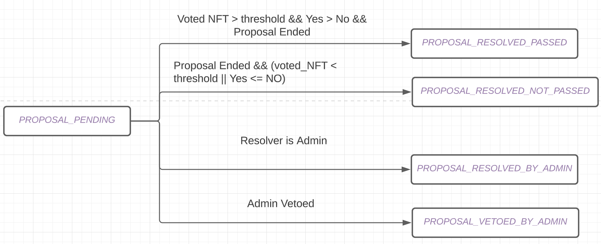

# NFT DAO V0 英文设计文档

PR: https://github.com/aptos-labs/aptos-core/pull/5918

## 动机

**摘自产品规范**

当前生态系统中没有简单的方法让项目在发行后与其社区互动。建立一个充满活力的 NFT 社区（以及其他 Web3 垂直领域的社区）的关键部分是通过 DAO 赋予持有者和支持者参与项目决策过程的能力。为了实现这一点，我们必须为 Aptos 上的项目提供易于使用的 DAO 管理工具，以建立一个由拥有 NFT 集合中特定代币所有权门槛限制的 DAO。

使用 NFT DAO，代币持有者可以：

- 创建一个与其现有 NFT 项目连接的 DAO
- 创建可以在链上投票的提案
- 完成并执行链上提案结果

## 概述

有多个角色：

- DAO 平台：部署合约并提供一个网站，供 NFT 社区创建 DAO、提出提案、进行投票和解决问题。
- DAO 管理员：通过平台创建 DAO。他们也可以将自己的管理权限转移给其他账户。DAO 管理员具有特殊权限，可以否决或执行不经过投票的提案。
- 提案人：创建提案的人
- 投票人：投票支持提案的人
- 解决者：解决提案的人

## 方法

### 主要数据结构

`[DAO](https://github.com/areshand/aptos-core-1/blob/98b5372b57c15df6b56d1b1879bebba2a1dc8b7b/aptos-move/move-examples/dao/nft_dao/sources/nft_dao.move#L103)`: 包含所有 DAO 的关键数据字段，包括 DAO 资源账户签名者能力。这些数据存储在 DAO 资源账户中。

`[Proposal](https://github.com/areshand/aptos-core-1/blob/98b5372b57c15df6b56d1b1879bebba2a1dc8b7b/aptos-move/move-examples/dao/nft_dao/sources/nft_dao.move#L139)`: 包含提案信息，包括要执行的函数及其参数。提案的状态变化如下图所示：



`[Proposals](https://github.com/areshand/aptos-core-1/blob/98b5372b57c15df6b56d1b1879bebba2a1dc8b7b/aptos-move/move-examples/dao/nft_dao/sources/nft_dao.move#L134)`: 包含每个 DAO 的所有提案。它将提案 ID 映射到 `Proposal`。这些数据存储在 DAO 资源账户中。

`[ProposalVotingStatistics](https://github.com/areshand/aptos-core-1/blob/98b5372b57c15df6b56d1b1879bebba2a1dc8b7b/aptos-move/move-examples/dao/nft_dao/sources/nft_dao.move#L158)`: 将提案 ID 映射到其投票统计信息。投票统计信息包含 yes 和 no 的计数，以及每个 token_id 的投票情况。

`[GovernanceToken](https://github.com/areshand/aptos-core-1/blob/98b5372b57c15df6b56d1b1879bebba2a1dc8b7b/aptos-move/move-examples/dao/nft_dao/sources/nft_dao.move#L126)`: 形成 DAO 的 NFT 集合。

### 一个示例 E2E 流程

1. 平台运营商部署此包以创建 DAO 平台。
2. 管理员创建一个 DAO。

```rust
public entry fun create_dao(
    admin: &signer,
    name: String,
    threshold: u64,
    voting_duration: u64,
    voting_token_collection_creator: address, 
    collection_name: String,
    min_required_proposer_voting_power: u64,
    required_proposer_voting_power: u64,
)
```

3. 提案人可以创建执行一系列函数的提案。

提案人可以在一个提案中组合任意数量的支持函数。在解决期间，函数列表将按顺序执行。

```rust
create_proposal(
  account: &signer,
  nft_dao: address,// nft dao 的资源账户地址
  name: String,// 提案名称
  description: String,// 提案描述
  function_names: vector<String>,// 支持的 3 种函数类型：(1) "no_op", (2) "transfer_fund" 和 (3) "offer_nft"
  arg_names: vector<vector<String>>,// 要调用函数的参数名称。这里的参数应与函数中使用的参数相同
  arg_values: vector<vector<vector<u8>>>,// 参数值的 bcs 序列化值
  arg_types:vector<vector<String>>,// 参数类型。目前仅支持 string、u8、u64、u128、bool、address。
  start_time_sec: u64,// 投票开始时间
  token_names: vector<String>,// 提议人希望用于提案的代币名称
  property_versions: vector<u64>,// 相应代币的属性版本，提议人希望用于提案
) acquires DAO, Proposals
```

可以创建三种类型的函数：

- `no_op`：链上不会自动执行任何操作。只记录提案及其结果供 DAO 管理员采取行动。
  - arg_names 空
  - arg_values 空
  - arg_types 空
- `transfer_fund`：资金将自动从 DAO 资源账户转移到目标账户。
  - arg_names: "dst"，"amount"
  - arg_values: bcs 序列化值，请参考 TS SDK 函数。需要提供 TS 中的原始值和 arg_types 以获取序列化值。

  [aptos-core/property_map_serde.ts at main · aptos-labs/aptos-core](https://github.com/aptos-labs/aptos-core/blob/main/ecosystem/typescript/sdk/src/utils/property_map_serde.ts#L48)

  - arg_types: "address"，"u64"

4. 投票人可以为 DAO 的提案投票

```rust
vote(
    account: &signer,
    nft_dao: address,
    proposal_id: u64,
    vote: bool,
    token_names: vector<String>,
    property_versions: vector<u64>,
)
```

要生成 token_ids 的批次，您需要提供相应的 token_names 和 property_versions：例如，token_names = ("monkey 1", "monkey 2")，property_versions = ("1", "0")

5. 任何人可以调用 resolve 解决提案。提案的投票期必须过期，并且提案的票数应超过最小所需阈值。

```rust
public entry fun resolve<CoinType>(proposal_id: u64, nft_dao: address)
```

### 特殊的 DAO 管理员功能

DAO 管理员可以执行一些特殊操作。这是为了让 NFT 创建者在 DAO 成熟之前管理他们的 DAO。一旦 DAO 成熟，他们可以通过更新字段摆脱管理员地址。以下是一些特殊的 DAO 管理员操作：

**DAO 管理员转移**

DAO 管理员可以通过提供 - 领取的两步过程转移他的管理权限。他也可以在任何人领取之前取消待处理的提案。

- `offer_admin`：向另一个账户提供管理权限。此提供直接记录在 DAO 结构中。
- `claim_admin`：接收者可以领取此提供。合约将把 DAO 的管理员设置为接收者，并清空待领取的提案。
- `cancel_admin_offer`：管理员也可以取消一个管理权限提供，方法是在 DAO


# 详解

## `nft_dao.move`

使用 NFT DAO，代币持有者可以：
- 创建一个 DAO 并将其连接到他们现有的 NFT 项目
- 创建可以在链上投票的提案
- 对提案的结果进行结论并在链上执行

一个端到端的示例流程。更多详细信息请查看“一个示例 E2E 流程”部分
有多个角色：DAO 平台运营商、DAO 创建者、提案人和投票人。
1. 平台运营商部署此包以创建 DAO 平台。他们可以将合约部署为不可变的，以实现无需信任。
2. DAO 创建者调用 `create_dao` 来创建他们的 DAO。这将在一个单独的资源账户中创建 DAO。
3. 提案人可以指定他们要创建提案的 DAO，并通过 `create_proposal` 创建提案。
   一个提案可以执行三种类型的函数列表。例如，转移多个 NFT 可以是多个 `offer_nft` 函数的提案：
        a: no-op，链上不会执行任何操作。只记录提案及其结果，供 DAO 管理员在链下采取行动。
        b: 从 DAO 账户转移 APT 资金到指定的目标账户。
        c: 将 NFT 提供给指定的目标账户。
4. 投票人可以通过 `vote` 为 DAO 的提案投票。
5. 任何人都可以调用 `resolve` 解决一个提案。提案的投票期必须过期，并且提案应该获得超过最小所需阈值的投票。

DAO 平台还支持管理员操作。更多详细信息，请查看自述文件中的“特殊 DAO 管理员功能”部分。

一个现有 DAO 平台中移除 DAO 的示例。
1. DAO 创建者可以调用 `reclaim_signer_capability` 来从平台中移除他们的 DAO，并恢复他们的资源账户签名能力。


## `bucket_table.move`
这个包是从 `move-examples/data_structures/sources/bucket_table.move` 复制过来的，用于展示完整的部署在链上的包。


---
# NFT DAO V0 Eng Design Doc
PR: https://github.com/aptos-labs/aptos-core/pull/5918

## Motivation

*Quoted from product specification*

Currently there are no easy ways for projects in the ecosystem to engage with their communities post mint. A key part of building a vibrant NFT community (as well as community of other web3 verticals) is to empower holders and supporters to be included in the decision making process of a project via a DAO. To do this, we must provide easy to use DAO management tooling for projects on Aptos to build a DAO where entry is gated by the ownership of a token in a NFT collection.

With the NFT DAO, token holders can 

- be able to create a DAO and connect it to my existing NFT project
- be able to create proposals that can be voted on-chain
- be able to have proposal results conclude and execute on-chain

## Overview

There are multiple roles:

- DAO platform: the entity deploys the contract and provides one website for the NFT community to create DAO, propose, vote, and resolve.
- DAO admin: this entity creates the DAO through the platform. They can also transfer their admin authority to other accounts. DAO admin has special authority to veto or execute a proposal without voting
- Proposer:  people who create a proposal
- Voter: people who vote on a proposal
- Resolver: people who resolve a proposal

## Approach

### Key Data Structs

`[DAO](https://github.com/areshand/aptos-core-1/blob/98b5372b57c15df6b56d1b1879bebba2a1dc8b7b/aptos-move/move-examples/dao/nft_dao/sources/nft_dao.move#L103)`: this contains all the DAO’s key data fields including DAO resource account signer capability. This data is stored in the DAO resource account.

`[Proposal](https://github.com/areshand/aptos-core-1/blob/98b5372b57c15df6b56d1b1879bebba2a1dc8b7b/aptos-move/move-examples/dao/nft_dao/sources/nft_dao.move#L139)`: this contains the proposal info including the functions and their arguments to be executed.  The state change of proposal is as below:


`[Proposals](https://github.com/areshand/aptos-core-1/blob/98b5372b57c15df6b56d1b1879bebba2a1dc8b7b/aptos-move/move-examples/dao/nft_dao/sources/nft_dao.move#L134)`: this contains all the proposals of each DAO. It maps the proposal id to the `Proposal`. This is stored in the DAO resource account

`[ProposalVotingStatistics](https://github.com/areshand/aptos-core-1/blob/98b5372b57c15df6b56d1b1879bebba2a1dc8b7b/aptos-move/move-examples/dao/nft_dao/sources/nft_dao.move#L158)`: this maps the proposal id to its voting statistics. The voting statistics contain the yes and no counts and the vote of each token_id.

`[GovernanceToken](https://github.com/areshand/aptos-core-1/blob/98b5372b57c15df6b56d1b1879bebba2a1dc8b7b/aptos-move/move-examples/dao/nft_dao/sources/nft_dao.move#L126)`: the NFT collection that forms a DAO.

### An Example E2E Flow

1. Platform operators deploy this package to create a DAO platform
2. Admin creates a DAO

```rust
public entry fun create_dao(
    admin: &signer,
    name: String,
    threshold: u64,
    voting_duration: u64,
    voting_token_collection_creator: address, 
    collection_name: String,
    min_required_proposer_voting_power: u64,
    required_proposer_voting_power: u64,
)
```

3. Proposer can create a proposal executing a list of functions.

Proposer can combine any number of supported functions in one proposal. During resolving, the list of functions will be executed in sequence.
```rust
create_proposal(
  account: &signer,
  nft_dao: address,// resource account address of the nft dao
  name: String,// name of the proposal
  description: String,// description of the proposal
  function_names: vector<String>,// 3 types of functions are supported: (1) "no_op", (2) "transfer_fund" and (3) "offer_nft"
  arg_names: vector<vector<String>>,// name of the arguments of the function to be called. The arg here should be the same as the argument used in the function
  arg_values: vector<vector<vector<u8>>>,// bcs serailized values of argument values
  arg_types:vector<vector<String>>,// types of arguments. currently, we only support string, u8, u64, u128, bool, address.
  start_time_sec: u64,// when the voting starts
  token_names: vector<String>,// The name of the token, the proposer want to use for proposing
  property_versions: vector<u64>,// the property versions of the corresponding tokens, the proposer want to use for proposing
) acquires DAO, Proposals
```

3 types of functions can be created:

- `no_op`, no automatic execution happens on-chain. Only the proposal and its result is recorded on-chain for the DAO admin to take actions
    - arg_names empty
    - arg_values empty
    - arg_types empty
- `transfer_fund`, the fund will be automatically transferred from DAO resource account to the destination account.
    - arg_names: “dst”, “amount”
    - arg_values: bcs_serialized values, please refer to TS SDK function. You need to provide original values in TS and arg_types to get the serialized values
    
    [aptos-core/property_map_serde.ts at main · aptos-labs/aptos-core](https://github.com/aptos-labs/aptos-core/blob/main/ecosystem/typescript/sdk/src/utils/property_map_serde.ts#L48)
    
    - arg_types: “address”, “u64”

4. A voter can vote for a proposal of a DAO

```rust
vote(
    account: &signer,
    nft_dao: address,
    proposal_id: u64,
    vote: bool,
    token_names: vector<String>,
    property_versions: vector<u64>,
)
```

To generate the batch of token_ids, You need to provide corresponding token_names and property_versions: For example, token_names = (”monkey 1”, “monkey 2”), property_versions = (”1”, “0”)

5. Anyone can call resolve to resolve the proposal. A proposal voting duration has to expire and the proposal should have more votes than the minimum required threshold.

```rust
public entry fun resolve<CoinType>(proposal_id: u64, nft_dao: address)
```

### Special DAO Admin Functions

DAO admin can perform some special operations. This is to provide the NFT creator a way to manage their DAO before the DAO becomes mature. Once the DAO becomes mature, they can get rid of the admin address by updating the field. The functions below are some special DAO admin operations: 

**DAO Admin transfer**

DAO admin can transfer his admin authority through an offer - claim two step process. He can also cancel an pending offer before anyone claims the offer.

- `offer_admin`: offer the admin authority to another account.  This offer is directly recorded in the DAO struct
- `claim_admin`: the receiver can claim this offer. The contract will set the admin of the DAO to this receiver and empty the pending claim
- `cancel_admin_offer`: the admin can also cancel an admin offer by making the pending claim field empty in the DAO struct.

**DAO admin privileges** 

- `admin_resolve`: admin of a DAO can directly resolve an **pending** proposal regardless of voting results and time. After resolving, the contract will record the resolution of the proposal as proposal resolved by admin.
- `admin_veto_proposal`: admin can veto an **pending** proposal regardless of voting results or time.  After vetoing, the contract will mark the resolution as vetoed by the admin
- update DAO configs: admin can use his authority to update the DAO’s name, proposal duration, resolve threshold, min power required to create proposal.

 

## Rationals

### Design principles

- No module deployment/ script compiling for each DAO in V0 to reduce the technical complexity for both users and partners
- The DAO platform should have a broader coverage of existing popular collections on Aptos
- Escrow-less voting to provide a better NFT owner experience and increase the supply of voting tokens

### Some aligned design choices

- Separate the `[ProposalVotingStatistics](https://github.com/areshand/aptos-core-1/blob/98b5372b57c15df6b56d1b1879bebba2a1dc8b7b/aptos-move/move-examples/dao/nft_dao/sources/nft_dao.move#L158)` from `[Proposal](https://github.com/areshand/aptos-core-1/blob/98b5372b57c15df6b56d1b1879bebba2a1dc8b7b/aptos-move/move-examples/dao/nft_dao/sources/nft_dao.move#L139)`,
    - NFT DAO records which token voted. This can take up a lot of space. We want to keep this data in a separate struct that can be destroyed later after proposal ends
- [Resolving threshold](https://github.com/areshand/aptos-core-1/blob/98b5372b57c15df6b56d1b1879bebba2a1dc8b7b/aptos-move/move-examples/dao/nft_dao/sources/nft_dao.move#L107) is an absolute number of NFTs
    - This is what we learned from our partners and our own investigation of existing DAOs’ setting
- Don’t allow the same token being used twice for voting by recording voted token_ids and deduping on token_id
    - This is to allow escrow-less voting and accommodating to existing NFTs since most of them are globally unique
- Relax to globally_unique_**now** from globally_unique_**permanently** as the constraint for **governance token**
    - globally_unique_**now**  requires TokenData to have a maximum = 1 and globally_unique_**permanently** requires TokenData to have a **maximum = 1 && maximum_mutable = false**
    - we found popular collections (eg Aptos mingo) are globally_unique_now. We want to make sure our tool work for these collections.
    - Relaxing the constraint doesn’t increase the risk since only the creator can mint more tokens. If the creator is the malicious entity, there is no way to
- Not supporting features like mutating the collection maximum requiring creator authority
    - [We don’t support move compiling in v0 for each DAO individually](https://www.notion.so/NFT-DAO-V0-Eng-Design-Doc-139179339c78475e95d1f3bb71df9f9d). This makes it infeasible to acquire the signer of the creator account to perform the operation.
- Use property map for serializing and deserializing proposal function arguments
    - Leverage existing support in both TS SDK and Move to support the serde of a list of heterogeneous arguments
    - Property map should be able to support all eligible TXN arguments through simple extension.
    - We can also switch to raw vectors since the property map is not exposed in the interface.
- Vote with a batch of tokens
    - To reduce the number of TXN required to vote

## Remaining Questions

**DAO upgrade**  upgrading DAO to support integration with creator resource account to gain creator authority to do mint more NFT, update the collection maximum, etc.

- [Significant blocker] browser side or server-side move compiling lacks TS tooling support for community developers
- Alternatives:
    - DAO admin compiles and executes the script themselves

**DAO migration** Have smooth migration when DAO platform contracts have breaking changes

Goal:

- One button click to transfer the DAO signer capability to the new DAO
- Keep all the historical proposal data intact

Some possible step:

- upgrade the old DAO contract and add a migration function in the old DAO contract
- show the migration button in UI and the user can click to create a new DAO under the new contract
- emitted DAO migration event to keep a history of DAO migration
- all the historical proposals are still stored in old contract space.

```rust
public fun migrate(admin: &signer, dao: address) {
	// extract the old_dao's signer_cap
	let signer_cap = destroy_dao_and_reclaim_signer_capability(admin, old_dao);
	new_dao_platform::create_new_dao(signer_cap, old_dao);
}
```