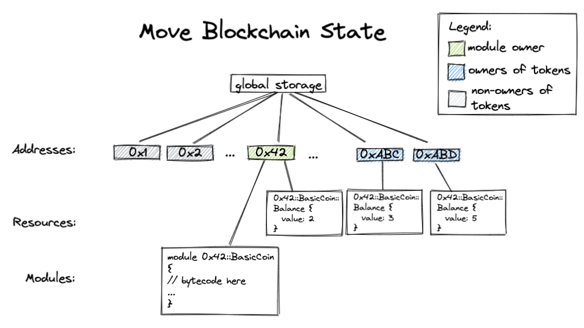

# Move 教程

欢迎来到 Aptos Move 教程！这是原始的 Move 语言和工具教程，独立于特定网络，已适配使用 Aptos 工具。在这里，你将学习到编译、测试和验证 Move 的基本使用方法。

本教程不教授如何使用现有的 [Aptos Move 框架](https://aptos.dev/reference/move) 或如何在 Aptos 网络上运行代码。有关这些说明，请参见 [Aptos 开发者文档](https://aptos.dev/tutorials/)。

总共有九个步骤：

- [步骤 0：准备](#步骤-0-准备)
- [步骤 1：编写我的第一个 Move 模块](#步骤-1-编写我的第一个-move-模块)
- [步骤 2：为我的第一个 Move 模块添加单元测试](#步骤-2-为我的第一个-move-模块添加单元测试)
- [步骤 3：设计我的 `basic_coin` 模块](#步骤-3-设计我的-basic_coin-模块)
- [步骤 4：实现我的 `basic_coin` 模块](#步骤-4-实现我的-basic_coin-模块)
- [步骤 5：为 `basic_coin` 模块添加并使用单元测试](#步骤-5-为-basic_coin-模块添加并使用单元测试)
- [步骤 6：使我的 `basic_coin` 模块泛型化](#步骤-6-使我的-basic_coin-模块泛型化)
- [步骤 7：使用 Move 证明器](#步骤-7--使用-move-证明器)
- [步骤 8：为 `basic_coin` 模块编写正式规范](#步骤-8-为-basic_coin-模块编写正式规范)

每个步骤都被设计为在相应的 `step_x` 目录中自包含。例如，如果你想跳过步骤 1 到 4 的内容，可以直接跳到步骤 5，因为所有在步骤 5 之前编写的代码都会在 `step_5` 目录中。在某些步骤的末尾，我们还包括了更高级主题的额外材料。

现在让我们开始吧！

## 步骤 0：准备

你应该获取包含此 `README.md` 的目录内容的副本。实现这一点的一种方式是克隆 [Aptos 核心仓库](https://github.com/aptos-labs/aptos-core) 并导航到 [`aptos-move/move-examples/move-tutorial`](..) 目录。之后，我们假设你有此目录的本地副本，并且所有路径都是相对于此的。为确保你有正确的内容，请运行下面的 `cd` 和 `ls` 命令，以确保 `move-tutorial` 目录具有相关的子目录：

```shell
> cd move-tutorial
> ls
step_1 step_2 step_2_sol step_3 ...
```

你还需要最新版本的 [Aptos CLI](https://aptos.dev/tools/aptos-cli/install-cli/)。本教程使用以下版本编写：

```shell
> aptos --version
aptos 1.0.7
```

如果你想使用 IDE 来完成示例，我们推荐 CLion/IntelliJ，它们对 Aptos Move 有很好的支持。

## 步骤 1：编写我的第一个 Move 模块

切换到 [`step_1/basic_coin`](./step_1/basic_coin) 目录。
你应该看到一个名为 `sources` 的目录——这是所有此包的 Move 代码所在的地方。你还应该看到一个 `Move.toml` 文件。这个文件指定了依赖项和有关包的其他信息；如果你熟悉 Rust 和 Cargo，`Move.toml` 文件类似于 `Cargo.toml` 文件，`sources` 目录类似于 Rust 中的 `src` 目录。

让我们来看一看一些 Move 代码！用你选择的编辑器打开 [`sources/first_module.move`](./step_1/basic_coin/sources/first_module.move)。你首先看到的是：

```
// sources/first_module.move
module 0xCAFE::basic_coin {
    ...
}
```

这是在定义一个 Move [模块](https://aptos.dev/move/book/modules-and-scripts/)。模块是 Move 代码的构建块，并在特定的地址下定义——该地址是模块可以发布在下面的地址。在这种情况下，`basic_coin` 模块只能在 `0xCAFE` 下发布。

现在让我们来看看这个文件的下一部分，我们在这里定义了一个 [结构体](https://aptos.dev/move/book/structs-and-resources) 来表示一个具有给定 `value` 的 `Coin`：

```
module 0xCAFE::basic_coin {
    struct Coin has key {
        value: u64,
    }
    ...
}
```

查看文件的其余部分，我们看到了一个函数定义，它创建了一个 `Coin` 结构体，并将其存储在账户下：

```
module 0xCAFE::basic_coin {
    struct Coin has key {
        value: u64,
    }

    public fun mint(account: &signer, value: u64) {
        move_to(account, Coin { value })
    }
}
```

让我们来仔细看看这个函数以及它的功能：
* 它接受一个 [`&signer`](https://aptos.dev/move/book/signer) 引用 ('`&`') —— 一个不可伪造的令牌，代表对特定地址的控制，以及一个要铸造的 `value`。
* 它创建了一个具有给定值的 `Coin` 并使用 `move_to` 操作符将其存储在 `account` 下。

让我们确保它能正常构建！这可以通过在包目录 ([`step_1/basic_coin`](./step_1/basic_coin/) 中) 使用 `aptos move compile` 命令来完成：

```bash
aptos move compile
```

<details>
<summary>高级概念和参考</summary>

* 你可以通过调用以下命令创建一个空的 Move 包：
    ```bash
    aptos move init --name <pkg_name>
    ```
* Move 代码也可以位于其他地方。有关 Move 包系统的更多信息，请参见 [Move 书籍](https://aptos.dev/move/book/packages)。
* `Move.toml` 文件的更多信息也可以在 Move 书籍的 [Package](https://aptos.dev/move/book/packages#movetoml) 部分找到。
* Move 还支持 [命名地址](https://aptos.dev/move/book/address#named-addresses) 的概念；命名地址是一种参数化 Move 源代码的方式，以便你可以使用不同的 `named_addr` 值来编译模块，以获得你可以部署的不同字节码，这取决于你控制的地址。它们使用非常频繁，并且可以在 `Move.toml` 文件的 `[addresses]` 部分中定义，如下所示：
    ```
    [addresses]
    Somenamed_address = "0xC0FFEE"
    ```
* Move 中的 [结构体](https://aptos.dev/move/book/structs-and-resources) 可以被赋予不同的 [能力](https://aptos.dev/move/book/abilities)，这些能力描述了可以对该类型进行的操作。有四种不同的能力：
    - `copy`：允许具有此能力类型的值被复制。
    - `drop`：允许具有此能力类型的值被弹出/丢弃。
    - `store`：允许具有此能力类型的值存在于全局存储中的结构体中。
    - `key`：允许类型作为全局存储操作的键。

    所以在 `basic_coin` 模块中，我们说 `Coin` 结构体可以用作全局存储中的键，并且由于它没有其他能力，它不能被复制、丢弃或作为非键值存储在存储中。所以你不能复制硬币，你也不能因为意外而丢失硬币！
* [函数](https://aptos.dev/move/book/functions) 默认是私有的，也可以是 `public`，
    [`public(friend)`](https://aptos.dev/move/book/friends)。
    标记为 `entry` 的函数可以作为交易调用。
* `move_to` 是 [五种不同的全局存储操作符](https://aptos.dev/move/book/global-storage-operators) 之一。
</details>

## 步骤 2：为我的首个 Move 模块添加单元测试<span id="Step2"><span>

现在我们已经看过了我们的第一个 Move 模块，我们将通过切换到 [`step_2/basic_coin`](./step_2/basic_coin) 目录来查看一个测试，以确保铸造工作符合我们的预期。单元测试在 Move 中与 Rust 中的单元测试类似——如果熟悉它们的话——测试用 `#[test]` 注释，并像普通的 Move 函数一样编写。

你可以使用 `aptos move test` 命令来运行测试：

```bash
aptos move test
```

现在让我们来看看 [`first_module.move` 文件](./step_2/basic_coin/sources/first_module.move) 的内容。你会看到以下测试：

```
module 0xCAFE::basic_coin {
    ...
    // 声明一个单元测试。它需要一个名为 `account` 的 signer，地址值为 `0xC0FFEE`。
    #[test(account = @0xC0FFEE)]
    fun test_mint_10(account: &signer) acquires Coin {
        let addr = 0x1::signer::address_of(account);
        mint(account, 10);
        // 确保在 `addr` 下有一个 `Coin` 资源，其值为 `10`。
        // 由于我们在定义 `Coin` 资源的同一模块中，我们可以访问此资源及其值。
        assert!(borrow_global<Coin>(addr).value == 10, 0);
    }
}
```

这是声明了一个名为 `test_mint_10` 的单元测试，它在 `account` 下铸造了一个 `value` 为 `10` 的 `Coin` 结构体。然后它检查存储中铸造的硬币是否具有预期的值，使用 `assert!` 调用。如果断言失败，单元测试将失败。

<details>
<summary>高级概念和练习</summary>

* 有一些值得探索的 [与测试相关的注释](https://aptos.dev/move/book/unit-testing#testing-annotations-their-meaning-and-usage)。
  你将在步骤 5 中看到其中一些的使用。

#### 练习
* 将断言改为 `11`，以便测试失败。找到一个你可以传递给 `aptos move test` 命令的标志，以便在测试失败时转储全局状态。它应该类似于：
  ```
  ┌── test_mint_10 ──────
  │ error[E11001]: test failure
  │    ┌─ ./sources/first_module.move:24:9
  │    │
  │ 18 │     fun test_mint_10(account: &signer) acquires Coin {
  │    │         ------------ In this function in 0xcafe::basic_coin
  │    ·
  │ 24 │         assert!(borrow_global<Coin>(addr).value == 11, 0);
  │    │         ^^^^^^^^^^^^^^^^^^^^^^^^^^^^^^^^^^^^^^^^^^^^^^^^^ Test was not expected to abort but it aborted with 0 here
  │
  │
  │ ────── Storage state at point of failure ──────
  │ 0xc0ffee:
  │       => key 0xcafe::basic_coin::Coin {
  │           value: 10
  │       }
  └──────────────────
  ```
* 找到一个允许你收集测试覆盖信息的标志，然后尝试使用 `aptos move coverage` 命令来检查覆盖统计信息和源覆盖。

</details>

## 步骤 3：设计我的 `basic_coin` 模块<span id="Step3"><span>

在本节中，我们将设计一个实现了基本硬币和余额接口的模块，其中可以铸造硬币并在不同地址持有的余额之间转移硬币。

> 注意：这里的硬币和余额接口仅用于说明 Move 概念。Aptos 使用一个不同的、更丰富的 [coin 类型](https://aptos.dev/reference/move?branch=mainnet&page=aptos-framework/doc/coin.md)，包含在 Aptos 框架中。

公共 Move 函数的签名如下：

```
/// 在 `account` 的地址下发布一个空余额资源。在铸造或转账到该账户之前，必须调用此函数。
public fun publish_balance(account: &signer) { ... }

/// 向 `mint_addr` 铸造 `amount` 个代币。铸造必须由模块所有者批准。
public fun mint(module_owner: &signer, mint_addr: address, amount: u64) acquires Balance { ... }

/// 返回 `owner` 的余额。
public fun balance_of(owner: address): u64 acquires Balance { ... }

/// 从 `from` 转移 `amount` 个代币到 `to`。
public fun transfer(from: &signer, to: address, amount: u64) acquires Balance { ... }
```

接下来我们看看这个模块需要的数据结构。

Move 模块没有自己的存储。相反，Move *全局存储*（我们称之为我们的区块链状态）是由地址索引的。在每个地址下都有 Move 模块（代码）和 Move 资源（值）。

全局存储大致看起来像这样，用 Rust 语法表示：

```rust
struct GlobalStorage {
    resources: Map<address, Map<ResourceType, ResourceValue>>
    modules: Map<address, Map<ModuleName, ModuleBytecode>>
}
```

Move 资源存储在每个地址下是一个从类型到值的映射。（一个观察敏锐的读者可能注意到这意味着每个地址只能有一种类型的一个值。）这方便地为我们提供了一个本地映射，按地址索引，这是通过构造类型安全的。在我们的 `basic_coin` 模块中，我们定义了以下 `Balance` 资源，表示每个地址持有的硬币数量：

```
/// 表示每个地址的余额的结构体。
struct Balance has key {
    coin: Coin // 与步骤 1 中的 Coin 相同
}
```

大致上，Move 区块链状态应该看起来像这样：



#### 高级话题：

<details>
<summary><code>public(script)</code> 函数</summary>

只有带有 `entry` 限定符的函数才能在交易中直接调用。所以如果你想直接从交易中调用 `transfer` 方法，你会想将其签名更改为：
```
public entry fun transfer(from: signer, to: address, amount: u64) acquires Balance { ... }
```
阅读更多关于 Move 函数 [可见性](https://aptos.dev/move/book/functions#visibility)。
</details>
<details>
<summary>与 Ethereum/Solidity 的比较</summary>

在大多数 Ethereum [ERC-20](https://ethereum.org/en/developers/docs/standards/tokens/erc-20/) 合约中，每个地址的余额存储在类型为 <code>mapping(address => uint256)</code> 的 _状态变量_ 中。这个状态变量存储在特定智能合约的存储中。

以太坊区块链状态可能看起来像这样：


</details>

## 步骤 4：实现我的 `basic_coin` 模块<span id="Step4"><span>

我们在 `step_4` 目录中为你创建了一个名为 `basic_coin` 的 Move 包。`sources` 目录包含了包内所有 Move 模块的源代码，包括 `basic_coin.move`。在本节中，我们将更仔细地查看 [`basic_coin.move`](./step_4/basic_coin/sources/basic_coin.move) 中方法的实现。

### 编译代码

让我们首先尝试使用以下命令构建代码
在 [`step_4/basic_coin`](./step_4/basic_coin) 目录中：

```bash
aptos move compile
```

### 方法实现
现在让我们来看看 [`basic_coin.move`](./step_4/basic_coin/sources/basic_coin.move) 中方法的实现。

<details>
<summary>方法 <code>publish_balance</code></summary>

这个方法向给定地址发布一个 `Balance` 资源。由于这个资源需要通过铸造或转移来接收硬币，所以在用户能够接收资金之前，包括模块所有者在内，必须调用 `publish_balance` 方法。

这个方法使用 `move_to` 操作来发布资源：

```
let empty_coin = Coin { value: 0 };
move_to(account, Balance { coin:  empty_coin });
```
</details>
<details>
<summary>方法 <code>mint</code></summary>

`mint` 方法向给定账户铸造硬币。这里我们要求 `mint` 必须由模块所有者批准。我们使用断言语句来强制执行这一点：
```
assert!(signer::address_of(&module_owner) == MODULE_OWNER, ENOT_MODULE_OWNER);
```
在 Move 中，断言语句可以这样使用：`assert!(<predicate>, <abort_code>);`。这意味着如果 `<predicate>` 为假，则使用 `<abort_code>` 中止交易。这里 `MODULE_OWNER` 和 `ENOT_MODULE_OWNER` 都是在模块开头定义的常量。标准库的 [`error`] 模块还定义了我们可以使用的常见错误类别。

需要注意的是，Move 在其执行中是事务性的——所以如果 [中止](https://aptos.dev/move/book/abort-and-assert) 被触发，则不需要执行状态的回滚，因为该事务中的任何更改都不会持久化到区块链中。

[`error` 模块]: https://github.com/aptos-labs/aptos-core/blob/main/aptos-move/framework/move-stdlib/sources/error.move

然后我们存入一个价值为 `amount` 的硬币到 `mint_addr` 的余额中：
```
deposit(mint_addr, Coin { value: amount });
```
</details>

<details>
<summary>方法 <code>balance_of</code></summary>

我们使用 `borrow_global`，这是全局存储操作符之一，来从全局存储中读取。
```
borrow_global<Balance>(owner).coin.value
                 |       |       \    /
              资源类型    地址    字段名称
```
</details>

<details>
<summary>方法 <code>transfer</code></summary>

这个函数从 `from` 的余额中提取 `amount` 个代币，并将代币存入 `to` 的余额中。让我们更仔细地看看 `withdraw` 辅助函数：
```
fun withdraw(addr: address, amount: u64) : Coin acquires Balance {
    let balance = balance_of(addr);
    assert!(balance >= amount, EINSUFFICIENT_BALANCE);
    let balance_ref = &mut borrow_global_mut<Balance>(addr).coin.value;
    *balance_ref = balance - amount;
    Coin { value: amount }
}
```
在方法开始时，我们断言提款账户有足够的余额。然后我们使用 `borrow_global_mut` 获取全局存储的可变引用，`&mut` 用于创建结构体字段的可变引用。然后我们通过这个可变引用修改余额，并返回一个新硬币，其提款金额。

</details>

### 练习
我们的模块中有两个 `TODO`，留给读者作为练习：
- 完成 `publish_balance` 方法的实现。
- 实现 `deposit` 方法。

这个练习的解决方案可以在 [`step_4_sol`](./step_4_sol) 目录中找到。

**额外练习**
- 如果我们向一个余额存入过多的代币会发生什么？

## 步骤 5：为 `basic_coin` 模块添加并使用单元测试<span id="Step5"><span>

在这一步中，我们将查看我们为步骤 4 中编写的代码编写的所有不同的单元测试。我们还将查看一些工具，这些工具可以帮助我们编写测试。

首先，在 [`step_5/basic_coin`](./step_5/basic_coin) 目录中运行 `aptos move test` 命令：

```bash
aptos move test
```

你应该看到类似于以下的输出：

```
INCLUDING DEPENDENCY MoveStdlib
BUILDING basic_coin
Running Move unit tests
[ PASS    ] 0xcafe::basic_coin::can_withdraw_amount
[ PASS    ] 0xcafe::basic_coin::init_check_balance
[ PASS    ] 0xcafe::basic_coin::init_non_owner
[ PASS    ] 0xcafe::basic_coin::publish_balance_already_exists
[ PASS    ] 0xcafe::basic_coin::publish_balance_has_zero
[ PASS    ] 0xcafe::basic_coin::withdraw_dne
[ PASS    ] 0xcafe::basic_coin::withdraw_too_much
Test result: OK. Total tests: 7; passed: 7; failed: 0
```

审查 [`basic_coin`](./step_5/basic_coin/sources/basic_coin.move) 模块中的测试；我们尝试将每个单元测试隔离到测试一个特定行为。

<details>
<summary>练习</summary>

在查看测试后，尝试编写一个名为 `balance_of_dne` 的单元测试，用于测试 `balance_of` 被调用时地址下不存在 `Balance` 资源的情况。它应该只有几行！

这个练习的解决方案可以在 [`step_5_sol`](./step_5_sol) 中找到。

</details>

## 步骤 6：使我的 `basic_coin` 模块泛型化<span id="Step6"><span>

在 Move 中，我们可以使用 [泛型](https://aptos.dev/move/book/generics) 来定义不同输入数据类型上的函数和结构。泛型是库代码的一个很好的构建块。在本节中，我们将使我们的简单 `basic_coin` 模块泛型化，以便它可以作为库模块被其他用户模块使用。

首先，我们向我们的数据结构添加类型参数：
```
struct Coin<phantom CoinType> has store {
    value: u64
}

struct Balance<phantom CoinType> has key {
    coin: Coin<CoinType>
}
```

我们也以相同的方式向我们的方法添加类型参数。例如，`withdraw` 变为以下形式：
```
fun withdraw<CoinType>(addr: address, amount: u64) : Coin<CoinType> acquires Balance {
    let balance = balance_of<CoinType>(addr);
    assert!(balance >= amount, EINSUFFICIENT_BALANCE);
    let balance_ref = &mut borrow_global_mut<Balance<CoinType>>(addr).coin.value;
    *balance_ref = balance - amount;
    Coin<CoinType> { value: amount }
}
```
查看 [`step_6/basic_coin/sources/basic_coin.move`](./step_6/basic_coin/sources/basic_coin.move) 以了解完整实现。

我们提供了一个名为 [`my_odd_coin`](./step_6/basic_coin/sources/my_odd_coin.move) 的小型模块，它实例化了 `Coin` 类型并自定义了其转移策略：只能转移奇数个硬币。我们还在 [`my_odd_coin`](./step_6/basic_coin/sources/my_odd_coin.move) 中包括了两个测试以测试这种行为。你可以使用你在步骤 2 和步骤 5 中学到的命令来运行测试。

#### 高级话题
<details>
<summary><code>phantom</code> 类型参数</summary>

在 `Coin` 和 `Balance` 的定义中，我们声明类型参数 `CoinType` 为 phantom，因为 `CoinType` 在结构定义中没有使用，或者仅作为 phantom 类型参数使用。

阅读更多关于 [phantom 类型参数](https://aptos.dev/move/book/generics#phantom-type-parameters) 在 Aptos Move Book 中的信息。
</details>

## 步骤 7：使用 Move Prover

> 注意：在运行 Move Prover 之前，请确保已安装 [Move Prover](https://aptos.dev/tools/aptos-cli/install-cli/install-move-prover) 及相关工具。

部署在区块链上的智能合约可能会操作高价值资产。作为一种使用严格数学方法描述行为和推理计算机系统正确性的技术，形式化验证已经在区块链中使用，以防止智能合约中的缺陷。[Move Prover](https://aptos.dev/move/prover/move-prover) 是一个用于 Move 语言编写的智能合约的不断发展的形式化验证工具。用户可以使用 [Move Prover](https://github.com/move-language/move/blob/main/language/move-prover/doc/user/prover-guide.md) 来使用 [Move 规范语言 (MSL)](https://github.com/move-language/move/blob/main/language/move-prover/doc/user/spec-lang.md) 指定智能合约的功能属性，然后使用证明器自动静态检查它们。
为了说明如何使用证明器，我们在 [basic_coin.move](./step_7/basic_coin/sources/basic_coin.move) 中添加了以下代码片段：

```
    spec balance_of {
        pragma aborts_if_is_strict;
    }
```

非正式地说，`spec balance_of {...}` 块包含方法 `balance_of` 的属性规范。让我们首先在 [`basic_coin`](./step_7/basic_coin/) 目录中使用以下命令运行证明器：

```bash
aptos move prove
```

这将输出以下错误信息：

```
error: abort not covered by any of the `aborts_if` clauses
   ┌─ ./sources/basic_coin.move:38:5
   │
35 │           borrow_global<Balance<CoinType>>(owner).coin.value
   │           ------------- abort happened here with execution failure
   ·
38 │ ╭     spec balance_of {
39 │ │         pragma aborts_if_is_strict;
40 │ │     }
   │ ╰─────^
   │
   =     at ./sources/basic_coin.move:34: balance_of
   =         owner = 0x29
   =     at ./sources/basic_coin.move:35: balance_of
   =         ABORTED

```

Move Prover 告诉我们需要明确指定函数 `balance_of` 中止的条件，这是由于在 `owner` 不拥有资源 `Balance<CoinType>` 时调用了函数 `borrow_global`。为了消除这个错误信息，我们添加了一个 `aborts_if` 条件，如下所示：

```
    spec balance_of {
        pragma aborts_if_is_strict;
        aborts_if !exists<Balance<CoinType>>(owner);
    }
```
添加这个条件后，再次尝试运行 `prove` 命令，以确认没有验证错误：
```bash
aptos move prove
```

## 步骤 8：为 `basic_coin` 模块编写正式规范

除了中止条件，我们还想定义功能属性。在步骤 8 中，我们通过为 `basic_coin` 模块中定义的方法指定属性，提供了 Move Prover 的更详细介绍。

<details>

<summary> 方法 withdraw </summary>

方法 `withdraw` 的签名如下：
```
fun withdraw<CoinType>(addr: address, amount: u64) : Coin<CoinType> acquires Balance
```

方法 `withdraw` 从地址 `addr` 取出价值为 `amount` 的代币，并返回一个价值为 `amount` 的创建的 Coin。方法 `withdraw` 在以下情况下中止：1）`addr` 没有资源 `Balance<CoinType>` 或 2）`addr` 中的代币数量小于 `amount`。我们可以这样定义条件：

```
    spec withdraw {
        let balance = global<Balance<CoinType>>(addr).coin.value;
        aborts_if !exists<Balance<CoinType>>(addr);
        aborts_if balance < amount;
    }
```

在这里，我们可以看到 spec 块可以包含 let 绑定，它们为表达式引入名称。`global<T>(address): T` 是一个内置函数，返回 `addr` 处的资源值。`balance` 是 `addr` 拥有的代币数量。`exists<T>(address): bool` 是一个内置函数，如果地址处存在资源 T，则返回 `true`。两个 `aborts_if` 子句对应上述两个条件。

通常，如果一个函数有多个 `aborts_if` 条件，这些条件将彼此或运算。默认情况下，如果用户想要指定中止条件，需要列出所有可能的条件。否则，Move Prover 将生成验证错误。然而，如果在 spec 块中定义了 `pragma aborts_if_is_partial`，则组合的中止条件（或运算的个别条件）只 *暗示* 函数中止。

有关更多信息，请参考 [MSL](https://github.com/move-language/move/blob/main/language/move-prover/doc/user/spec-lang.md) 文档。

下一步是定义功能属性，这在以下两个 `ensures` 子句中进行了描述。首先，使用 `let post` 绑定，`balance_post` 表示执行后 `addr` 的余额，应该等于 `balance - amount`。然后，返回值（表示为 `result`）应该是一个价值为 `amount` 的硬币。

```
    spec withdraw {
        let balance = global<Balance<CoinType>>(addr).coin.value;
        aborts_if !exists<Balance<CoinType>>(addr);
        aborts_if balance < amount;

        let post balance_post = global<Balance<CoinType>>(addr).coin.value;
        ensures balance_post == balance - amount;
        ensures result == Coin<CoinType> { value: amount };
    }
```
</details>

<details>
<summary> 方法 deposit </summary>

方法 `deposit` 的签名如下：

```
fun deposit<CoinType>(addr: address, check: Coin<CoinType>) acquires Balance
```

方法将 `check` 存入 `addr`。规范定义如下：

```
    spec deposit {
        let balance = global<Balance<CoinType>>(addr).coin.value;
        let check_value = check.value;

        aborts_if !exists<Balance<CoinType>>(addr);
        aborts_if balance + check_value > MAX_U64;

        let post balance_post = global<Balance<CoinType>>(addr).coin.value;
        ensures balance_post == balance + check_value;
    }
```

这里 `balance` 表示执行前 `addr` 中的代币数量，而 `check_value` 表示要存入的代币数量。如果 1) `addr` 没有资源 `Balance<CoinType>` 或 2) `balance` 和 `check_value` 的和大于类型 `u64` 的最大值，则该方法将中止。功能属性检查在执行后余额是否正确更新。

</details>

<details>

<summary> 方法 transfer </summary>


方法 `transfer` 的签名如下：

```
public fun transfer<CoinType: drop>(from: &signer, to: address, amount: u64, _witness: CoinType) acquires Balance
```

方法将 `from` 账户的 `amount` 硬币转移到地址 `to`。规范如下：

```
    spec transfer {
        let addr_from = signer::address_of(from);

        let balance_from = global<Balance<CoinType>>(addr_from).coin.value;
        let balance_to = global<Balance<CoinType>>(to).coin.value;
        let post balance_from_post = global<Balance<CoinType>>(addr_from).coin.value;
        let post balance_to_post = global<Balance<CoinType>>(to).coin.value;

        ensures balance_from_post == balance_from - amount;
        ensures balance_to_post == balance_to + amount;
    }
```

这里 `addr_from` 是 `from` 的地址。然后获取 `addr_from` 和 `to` 执行前后的余额。
`ensures` 子句指定从 `addr_from` 扣除 `amount` 个代币并添加到 `to`。然而，Move Prover 将生成以下错误信息：

```
error: post-condition does not hold
   ┌─ ./sources/basic_coin.move:57:9
   │
62 │         ensures balance_from_post == balance_from - amount;
   │         ^^^^^^^^^^^^^^^^^^^^^^^^^^^^^^^^^^^^^^^^^^^^^^^^^^^
   │
   ...
```

当 `addr_from` 等于 `to` 时，属性不成立。因此，我们可以在方法中添加断言 `assert!(from_addr != to)`，以确保 `addr_from` 不等于 `to`。

</details>


<details>

<summary> 练习 </summary>

- 为 `transfer` 方法实现 `aborts_if` 条件。
- 为 `mint` 和 `publish_balance` 方法实现规范。

这个练习的解决方案可以在 [`step_8_sol`](./step_8_sol) 中找到。

</details>


